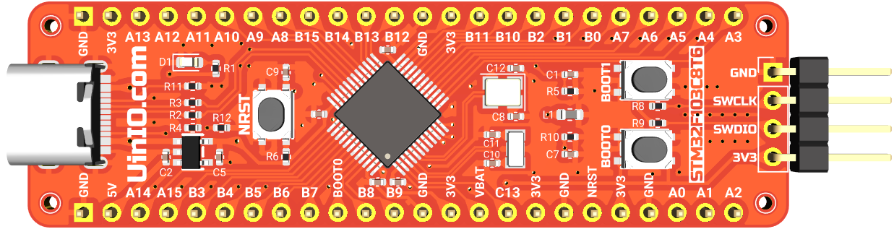
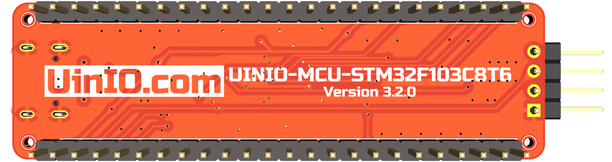

# UINIO-MCU-STM32F103C8T6 核心板

[**UINIO-MCU-STM32F103C8T6**](https://gitee.com/uinika/UINIO-MCU-STM32F103C8T6) 是一款基于 [**意法半导体**](https://www.st.com/zh/microcontrollers-microprocessors/stm32-32-bit-arm-cortex-mcus.html) **LQFP48** 封装的 **STM3232F103C8T6** 微控制器的核心板电路设计，该微控制器基于 **ARM Cortex-M3** 内核架构，主频可以达到 `72MHz`，片上载有 `64KB` 容量的 Flash 存储器和 `20Kbytes` 的 SRAM 存储器，并且拥有 3 组 `USART`，以及 CAN 接口、`USB2.0` 全速接口、12 位分辨率 `ADC/DAC`，整体上属于外设资源比较完善的高性价比主控芯片产品。

## 设计概要

1. 引出了 **STM32F103C8T6** 系列微控制器上面的全部 GPIO 引脚资源；
2. 单独提供有 4 线制 **SWD** 下载接口，便于快速与 [UINIO-DAP-Link](http://uinio.com/Project/UINIO-DAP-Link) 建立连接；
3. 使用 `8MHz` 与 `32.768KHz` 两枚贴片晶振，并且分别进行了简单的**包地**处理；

## 参考技术文档

[UinIO.com 电子技术实验室](http://uinio.com/) 为 UINIO-MCU-GD32F103CBT6 开源项目提供了如下一系列技术参考资料：

1. [《意法半导体 STM32F103C8T6 标准库典型实例》](http://uinio.com/Embedded/STM32F103/)
2. [《ARM 调试工具 UINIO-DAP-Link 应用详解》](http://uinio.com/Project/UINIO-DAP-Link/)
3. [《BOM 交互式物料清单与 PCB 布线在线预览》](http://uinio.com/archives/BOM/UINIO-MCU-STM32F103C8T6.html)
